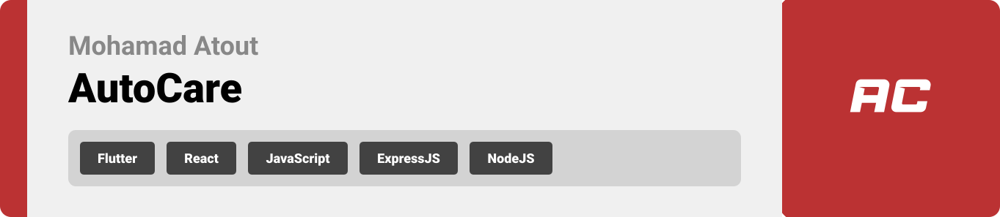

> Hello world! This is the project’s summary that describes the project plain, simple, and limited to the space available.

<br><br>

<!-- project philosophy -->


> A mobile app that connects people with car services providers.
>
> AutoCare aims to allow stores to present their products to the users, also users can benifit from the app by displaying their favourite store's product/s and adding them to their favourite list.

# User Stories

### Fore Admin User:

- As a user(admin) I want to change store's subscription status so that I can manage easier
- As a user(admin) I want to view satistics and graphes so that I can check for updates

### For Store Users:

- As a user(store) I want to add my services and products so that I can show them to the customers
- As a user(store) I want to send and recieve messages so that I can reach my customers easier

### For Customers Users:

- As a user(customer) I want to easily sign in and sig nup
- As a user(customer) I want to sign in and sign up with google services
- As a user(customer) I want to send and recieve messages so that I can reach service providers easier
- As a user(customer) I want to read and write reviews so that I can give and see other's opinion in the services provided

<br><br>

<!-- Prototyping -->


> We designed AutoCare using wireframes and mockups, iterating on the design until we reached the ideal layout for easy navigation and a seamless user experience.

### Wireframes

- Authentication

| Loading Screen                                     | Login Screen                                   | Register Screen                                    |
| -------------------------------------------------- | ---------------------------------------------- | -------------------------------------------------- |
|  | 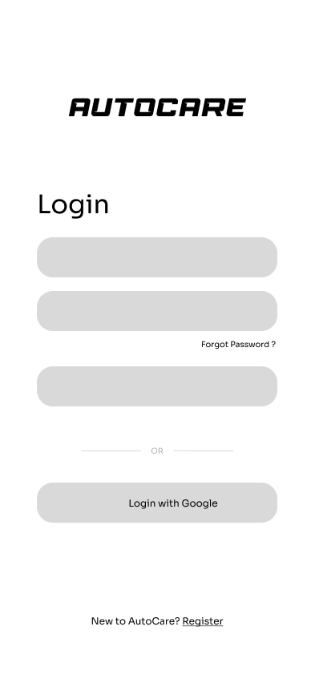 |  |

- Store Screens

| Store - Landing Screen                                            | Store - Chats Screen                                      | Store - Messages Screen                                      |
| ----------------------------------------------------------------- | --------------------------------------------------------- | ------------------------------------------------------------ |
|  |  |  |

| Store - Profile Screen                                        | Store - Add Item Screen                                        |
| ------------------------------------------------------------- | -------------------------------------------------------------- |
|  |  |

- Customer Screens

| Home Screen                                                    | View Store Screen                                                      | Favoutites Screen                                                  |
| -------------------------------------------------------------- | ---------------------------------------------------------------------- | ------------------------------------------------------------------ |
|  |  |  |

| Chats Screen                                                    | Messages Screen                                                  | Profile Screen                                                  |
| --------------------------------------------------------------- | ---------------------------------------------------------------- | --------------------------------------------------------------- |
|  |  |  |

### Mockups

- Authentication

| Loading Screen                               | Login Screen                             | Register Screen                              |
| -------------------------------------------- | ---------------------------------------- | -------------------------------------------- |
|  | 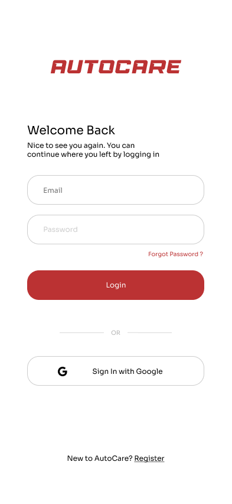 |  |

- Store Screens

| Store - Landing Screen                                      | Store - Chats Screen                                | Store - Messages Screen                                |
| ----------------------------------------------------------- | --------------------------------------------------- | ------------------------------------------------------ |
|  |  |  |

| Store - Profile Screen                                  | Store - Add Item Screen                                  |
| ------------------------------------------------------- | -------------------------------------------------------- |
|  |  |

- Customer Screens

| Home Screen                                              | View Store Screen                                                | Favoutites Screen                                           |
| -------------------------------------------------------- | ---------------------------------------------------------------- | ----------------------------------------------------------- |
|  |  |  |

| Chats Screen                                              | Messages Screen                                            | Profile Screen                                            |
| --------------------------------------------------------- | ---------------------------------------------------------- | --------------------------------------------------------- |
|  |  |  |

| Maps Screen                                                           |
| --------------------------------------------------------------------- |
|  |

<br><br>

<!-- Implementation -->


> Using the wireframes and mockups as a guide, we implemented AutoCare app with the following features:

### User Screens (Mobile)

- Authentication

| Login Screen                                         | Register Screen                                               | Google Screen                                                                |
| ---------------------------------------------------- | ------------------------------------------------------------- | ---------------------------------------------------------------------------- |
|  |  | 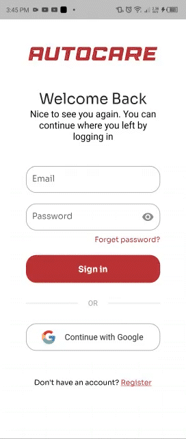 |

- Store Screens

| Store - Delete Products                                   | Store - Chats Screen                                     | Store - Messages Screen                                    |
| --------------------------------------------------------- | -------------------------------------------------------- | ---------------------------------------------------------- |
| 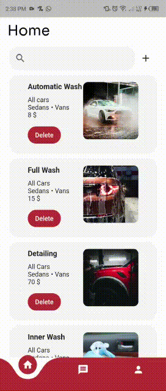 | 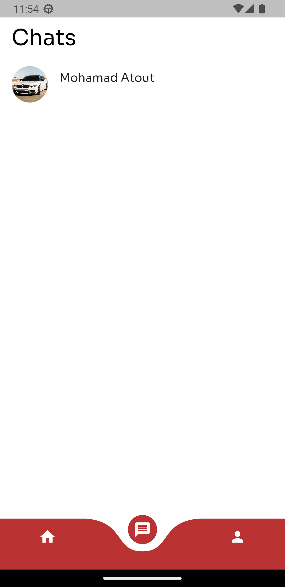 |  |

| Store - Profile Screen                                       | Store - Add Item Screen                                    |
| ------------------------------------------------------------ | ---------------------------------------------------------- |
| 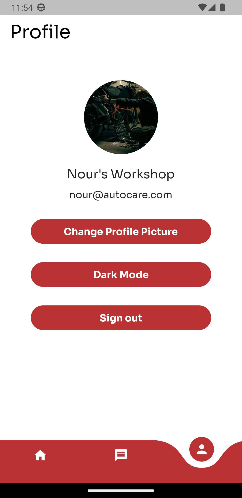 | 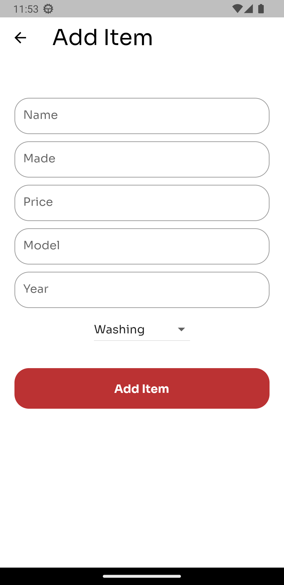 |

- Customer Screens

| Home Screen                                                  | View Store Screen                                               | Favoutites Screen                                         |
| ------------------------------------------------------------ | --------------------------------------------------------------- | --------------------------------------------------------- |
|  | 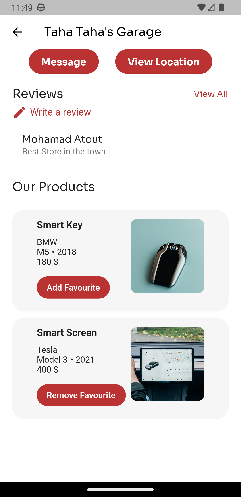 | 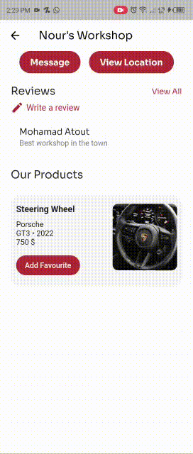 |

| Write Revirew                                                 | View on Maps                                      |
| ------------------------------------------------------------- | ------------------------------------------------- |
|  | 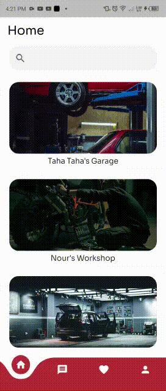 |

<br><br>

<!-- Tech stack -->


### AutoCare is built using the following technologies:

- This project uses the [Flutter app development framework](https://flutter.dev/). Flutter is a cross-platform hybrid app development platform which allows us to use a single codebase for apps on mobile, desktop, and the web.
- The app uses [Node.js](https://nodejs.org/en) for the backend. Node.js is a JavaScript runtime environment that allow running JavaScript code outside of a browser. Node.js is designed to build scalable network applications. Using [Express.js](https://expressjs.com/) which is a web application framework for Node.js. It provides a robust set of features to develop web and mobile applications.
- For trusted database foundation, the app uses the [MongoDB Atlas](https://www.mongodb.com/atlas/database) that enables you to work with data the way you want – easily and effortlessly.
  For notifications, the app uses [Firebase Cloud Messaging](https://firebase.google.com/docs/cloud-messaging) which is a cross-platform messaging solution that lets you reliably deliver messages at no cost.
- To send local push notifications, the app uses the [flutter_local_notifications](https://pub.dev/packages/flutter_local_notifications) package which supports Android, iOS, and macOS.
  - 🚨 Notification do not work on IOS simulators, so make sure to make run the project on a real IOS device for testing.
- The app uses the font ["Sora"](https://fonts.google.com/specimen/Sora) as its main font, and the design of the app adheres to the material design guidelines.
- The app logo uses the font ["Race Sport"](https://www.dafont.com/race-sport.font) as its main font, and the design of the app adheres to the material design guidelines.

<br><br>

<!-- How to run -->


> To set up AutoCare locally, follow these steps:

### Prerequisites

This is an example of how to list things you need to use the software and how to install them.

- npm
  ```sh
  npm install npm@latest -g
  ```

### Installation

_Below is an example of how you can instruct your audience on installing and setting up your app. This template doesn't rely on any external dependencies or services._

1. Clone the repo
   ```sh
   git clone https://github.com/MhmdAtout/autocare
   ```
2. Install [Node.js](https://nodejs.org/en)
3. Go to the server directory
   ```sh
   cd autocare-server
   ```
4. Install `npm packages`
   ```js
   npm install
   ```
5. Run the server
   ```js
   nodemon .
   ```
   If it didn't work, try
   ```js
   npm run serve
   ```
6. Install [Flutter SDK](https://docs.flutter.dev/get-started/install?gclid=Cj0KCQiAveebBhD_ARIsAFaAvrEXbca0gKEuW9ROxwC86eiEtJUUO5tm-AIIzds41AXpzsjkbESCw2EaAsTwEALw_wcB&gclsrc=aw.ds)
7. Follow flutter's documentation to install according to your machine's operation system
8. Install Flutter plugins
9. Go back to main directory
   ```js
   cd ..
   ```
10. Go to flutter app directory
    ```js
    cd autocare-app
    ```
11. Install flutter packages
    ```js
    flutter pub get
    ```
12. Run AutoCare flutter app
    ```js
    flutter run
    ```

Now, you should be able to run AutoCare locally and explore its features.
